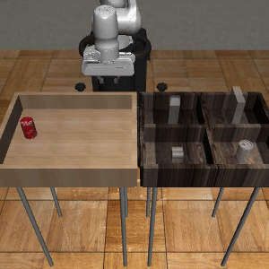

# DP-Attacker

[[Project page]](https://sites.google.com/view/diffusion-policy-attacker/home)
[[Paper]](https://arxiv.org/abs/2405.19424)

[Yipu Chen](https://peterchenyipu.github.io/)\*,
[Haotian Xue](https://xavihart.github.io/)\*,
[Yongxin Chen](https://yongxin.ae.gatech.edu/)
@Georgia Tech




## Installation

Install conda environment on a Linux machine with Nvidia GPU. You also need the following dependencies to make MuJoCo work:

```bash
sudo apt install -y libosmesa6-dev libgl1-mesa-glx libglfw3 patchelf
```

Create Conda environment:

```bash
mamba env create -f conda_environment.yaml
```

Activate the conda environment and install kornia with:

```bash
pip install kornia --no-deps
pip install kornia-rs --no-deps
```

Some RoboSuite source files are needed to enable patch attack support.

Download training data and checkpoints from https://diffusion-policy.cs.columbia.edu/data. Note that DP-Attacker only works with the image based Diffusion Policies. You also need to download the corresponding datasets while performing offline attacks. The final data folder looks like1this:

```

.
├── experiments
│   └── image
│       ├── can_mh
│       │   ├── diffusion_policy_cnn
│       │   └── diffusion_policy_transformer
│       ├── can_ph
│       │   ├── diffusion_policy_cnn
│       │   └── diffusion_policy_transformer
│       ├── lift_mh
│       │   ├── diffusion_policy_cnn
│       │   └── diffusion_policy_transformer
│       ├── lift_ph
│       │   ├── diffusion_policy_cnn
│       │   └── diffusion_policy_transformer
│       ├── pusht
│       │   ├── diffusion_policy_cnn
│       │   └── diffusion_policy_transformer
│       ├── square_mh
│       │   ├── diffusion_policy_cnn
│       │   └── diffusion_policy_transformer
│       ├── square_ph
│       │   ├── diffusion_policy_cnn
│       │   └── diffusion_policy_transformer
│       ├── tool_hang_ph
│       │   ├── diffusion_policy_cnn
│       │   └── diffusion_policy_transformer
│       ├── transport_mh
│       │   ├── diffusion_policy_cnn
│       │   └── diffusion_policy_transformer
│       └── transport_ph
│           ├── diffusion_policy_cnn
│           └── diffusion_policy_transformer
├── pusht
│   └── pusht_cchi_v7_replay.zarr
│       ├── data
│       │   ├── action
│       │   ├── img
│       │   ├── keypoint
│       │   ├── n_contacts
│       │   └── state
│       └── meta
│           └── episode_ends
└── robomimic
    └── datasets
        ├── can
        │   ├── mh
        │   └── ph
        ├── lift
        │   ├── mh
        │   └── ph
        ├── square
        │   ├── mh
        │   └── ph
        ├── tool_hang
        │   └── ph
        └── transport
            ├── mh
            └── ph
```

## Performing Attacks

The hydra config files that relates performing attacks are located in `attack_configs/eval_attack_config`. 4 different types of attack are available:

1. No Attack
2. Random Noise
3. Global Online
4. Global Offline (pre-gen attack)
5. Patched Offline (patch attack)

To run an attack, you need to specify the attack config file (see `attack_configs/eval_attack_config/attack`), and a checkpoint file (see `attack_configs/eval_attack_config/ckpt`).

An example is like this:

```bash
python eval_generic.py --config-name=attack_config attack=c_untargeted_ddpm_full ckpt=lift_ph_tf_best
```

For offline attacks, you need to train an attack noise/patch. The following section shows how to do this.

## Offline Attack Training

### Global Offline

To train a global offline attack noise. Use the following script:

```bash
python train_attack_img.py --config-name=c_pgd_0.03_targeted  ckpt=can_ph_tf_best 
```

You need to specify the checkpoint `ckpt` and the training parameters `--config-name`. See `attack_configs/train_attack_config/` folder for details. After training, you should be able to find the corresponding trained `.npy` file in the `data/outputs/attack_train` folder.

### Patched Offline

To train a global offline attack noise. Use the following script:

```bash
python train_physical_attack.py --config-name=lift_ph_tf_best                                                
```

See `attack_configs/train_physical_attack_config/` folder for details. After training, you should be able to find the corresponding trained `.png` file in the `data/outputs/physical_attack_train` folder.

## Code Organization

Online attacks are implemented in `diffusion_policy/policy/diffusion_transformer_hybrid_image_policy.py` and `diffusion_policy/policy/diffusion_unet_hybrid_image_policy.py`.

- `predict_action_attacked`: our online global attack algorithm.

Offline attacks are implemented as workspaces:

- `diffusion_policy/workspace/train_adversary_workspace.py`: Offline patched attack.
- `diffusion_policy/workspace/train_adversary_workspace.py`: Offline global attack.